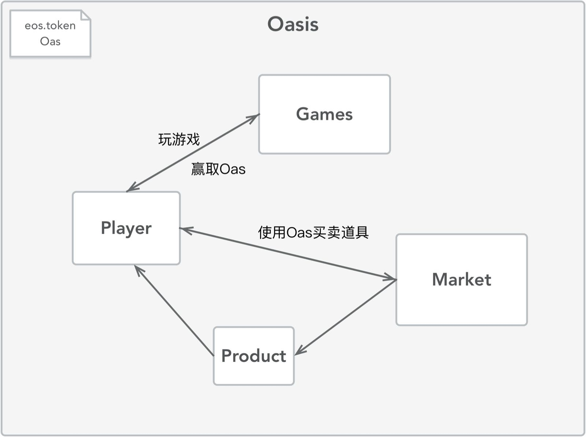

**EOS实践课程(二)**
----------------------------------------------
在上一节中，我们介绍了Player角色的设计和合约实现，也增加了Player的道具和技能，这一节我们将继续实现后续模块。

>游戏设计
主要包含以下模块：
* Player (已实现初步版本)
* Market
* Product
* Game
* eosio.token OAS

>主要模块如下：


>类定义如下：


在开始Marketplace的实现之前，我们需要先实现Oasis世界里的token，叫做'OAS'。
可以直接使用eos官方的[eosio.token合约](https://github.com/EOSIO/eos/tree/v1.0.8/contracts/eosio.token)。

**注意**：本节的实践交互基于上节的Player合约和创建的玩家，如果重启了本地测试网络，请重新执行上节09的实践命令，然后再继续本节。

1. 创建一个新账户token
```Bash
cleos create account eosio token EOS8eHNwPjCvcQRnUP1feykKmKexWkRz5zXznK3GTJFPibut7kiaM EOS7UN5ZY6WYpVhjkjPG4bh5rQxHgAeFKnjLBNok22cATD82JPjai
```

2. 部署合约eosio.token
```Bash
sh build_release.sh token ./oasis/contracts/eosio.token
```

3. 创建token:OAS
```Bash
cleos push action token create '{"issuer":"token","maximum_supply":"1000000.0000 OAS","can_freeze":"0","can_recall":"0","can_whitelist":"0"}' -p token@active
```

4. 给player账户转一些OAS
```Bash
# Issue tokens to account player and token
cleos push action token issue '{"to":"token","quantity":"5000.0000 OAS","memo":"init"}' -p token@active

cleos push action token issue '{"to":"player","quantity":"5000.0000 OAS","memo":"init"}' -p token@active

```


//TODO:查看player账户余额

5. 创建market账户
```Bash
cleos create account eosio market EOS8eHNwPjCvcQRnUP1feykKmKexWkRz5zXznK3GTJFPibut7kiaM EOS7UN5ZY6WYpVhjkjPG4bh5rQxHgAeFKnjLBNok22cATD82JPjai
```

6. 部署Marketplace合约
```Bash
sh build_release.sh market ./oasis/contracts/Marketplace
```

7. 创建新的Product
```Bash
cleos push action market add '{"account":"market","newProduct":{"product_id":1,"name":"magic ball","power":120,"health":10,"ability":"see the future","level_up":3,"quantity":10,"price":150}}' -p market@active

executed transaction: d1870a33e1007d7df6a004083b944cb65039948c4275f0d6f366541d082f9da4  176 bytes  3141 us
#        market <= market::add                  {"account":"market","newProduct":{"product_id":1,"name":"magic ball","power":120,"health":10,"abilit...
```

8. 使用ID查看Product
```Bash
cleos push action market getbyid '[1]' -p market

executed transaction: 4191cd3b38c6bcebf28e7b1462f070ef9368c9263c88ca43e3e86ef4b358c9b4  104 bytes  1544 us
#        market <= market::getbyid              {"productId":1}
>> Id: 1 | Name: magic ball | Power: 120 | Health: 10 | Ability: see the future | Level up: 3 | Quantity: 10 | Price: 150
```

9. 再增加一个Product
```Bash
cleos push action market add '{"account":"market","newProduct":{"product_id":2,"name":"potion","power":50,"health":300,"ability":"heal fast","level_up":0,"quantity":4,"price":350}}' -p market@active

executed transaction: 2c84840cb48e5f007e3cf8d4de08df439778689c1f36c7acfde3b972d207528b  168 bytes  3089 us
#        market <= market::add                  {"account":"market","newProduct":{"product_id":2,"name":"potion","power":50,"health":300,"ability":"...
```

10. 按照ID更新Product
```Bash
# Update potion quantity to 7
cleos push action market update '["market",2,3]' -p market@active
```
查看更新后的Product：
```Bash
cleos push action market getbyid '[2]' -p market
executed transaction: 28770407080941e1b10bc0bfed8615930c9c2d0d1ca14494d4254a654499774a  104 bytes  1267 us
#        market <= market::getbyid              {"productId":2}
>> Id: 2 | Name: potion | Power: 50 | Health: 300 | Ability: heal fast | Level up: 0 | Quantity: 7 | Price: 350
```

11. 从Marketplace买东西
```Bash
# Buy product from Marketplace
cleos push action market buy '["player",1]' -p player@active

executed transaction: 3e549fa8273c16c1c3cbae747e294675e2cb79977bdc6582a02c665943d95534  112 bytes  5785 us
#        market <= market::buy                  {"buyer":"player","productId":1}
#        player <= player::transfer             "000000005ce54dac000000006405af919600000000000000044f41530000000000"
#        market <= market::additem              "000000005ce54dac01000000000000000a6d616769632062616c6c78000000000000000a000000000000000e73656520746...
```

//TODO:查看一下Player的余额变化，合约间调用失败，可能需要授权Player
12. 授权重试
```Bash
cleos set account permission player active '{"threshold": 1,"keys": [],"accounts": [{"permission":{"actor":"market","permission":"eosio.code"},"weight":1}]}' owner -p player@owner
```


**参考文献**
----------------------------------------------
1. 一个供参考的Oasis: https://github.com/dabdevelop/playerone
