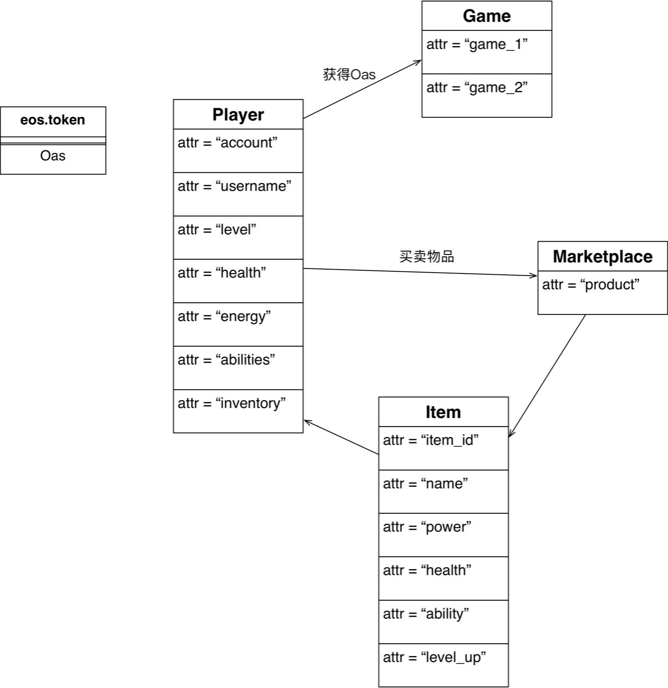

**EOS实践课程(三)**
----------------------------------------------
在上一节中，我们介绍了Marketplace合约、Product的定义，并且发布了token：OAS，实践了player购买product的buy方法，但是遇到一些问题，课后已经更新10课程的说明文档，所有问题均已解决。


>游戏设计
主要包含以下模块：
* Player (已实现初步版本)
* Market
* Product
* Game
* eosio.token OAS

>主要模块如下：


>类定义如下：



**创建游戏场景**
在实现单独的Games合约之前，我们尝试在Players合约内部增加fight方法，支持两个player的pk游戏性。
当然这么做的主要原因是，Games合约获取Players合约的数据，可能并不是很方便，接下来会介绍如何实现Games合约获取Players合约的player数据。
1. 创建player账户
```Bash
cleos create account eosio player EOS8eHNwPjCvcQRnUP1feykKmKexWkRz5zXznK3GTJFPibut7kiaM EOS7UN5ZY6WYpVhjkjPG4bh5rQxHgAeFKnjLBNok22cATD82JPjai

cleos create account eosio player1 EOS8eHNwPjCvcQRnUP1feykKmKexWkRz5zXznK3GTJFPibut7kiaM EOS7UN5ZY6WYpVhjkjPG4bh5rQxHgAeFKnjLBNok22cATD82JPjai

cleos create account eosio player2 EOS8eHNwPjCvcQRnUP1feykKmKexWkRz5zXznK3GTJFPibut7kiaM EOS7UN5ZY6WYpVhjkjPG4bh5rQxHgAeFKnjLBNok22cATD82JPjai
```

2. 部署Player合约
```Bash
sh build_release.sh player ./oasis/contracts/Players
```

3. 调用合约fight方法
```Bash
cleos push action player fight '["player1","player2"]' -p player1@active

executed transaction: 895a7a97b77b86746e711b8314b46b8c7a46a5408aaf9c2e008d123ceb819065  112 bytes  2410 us
#        player <= player::fight                {"player1":"player1","player2":"player2"}
>> random: -115| Winner is: player1
```

4. 让player1购买道具之后再fight
```Bash
cleos create account eosio token EOS8eHNwPjCvcQRnUP1feykKmKexWkRz5zXznK3GTJFPibut7kiaM EOS7UN5ZY6WYpVhjkjPG4bh5rQxHgAeFKnjLBNok22cATD82JPjai

sh build_release.sh token ./oasis/contracts/eosio.token

cleos push action token create '{"issuer":"token","maximum_supply":"1000000.0000 OAS","can_freeze":"0","can_recall":"0","can_whitelist":"0"}' -p token@active

cleos push action token issue '{"to":"player1","quantity":"5000.0000 OAS","memo":"init"}' -p token@active

cleos create account eosio market EOS8eHNwPjCvcQRnUP1feykKmKexWkRz5zXznK3GTJFPibut7kiaM EOS7UN5ZY6WYpVhjkjPG4bh5rQxHgAeFKnjLBNok22cATD82JPjai

sh build_release.sh market ./oasis/contracts/Marketplace

cleos push action market add '{"account":"market","newProduct":{"product_id":1,"name":"magic ball","power":120,"health":10,"ability":"see the future","level_up":3,"quantity":10,"price":150}}' -p market@active

cleos set account permission player1 active '{"threshold": 1,"keys": [{"key": "EOS7UN5ZY6WYpVhjkjPG4bh5rQxHgAeFKnjLBNok22cATD82JPjai","weight": 1}],"accounts": [{"permission":{"actor":"market","permission":"eosio.code"},"weight":1}]}' owner -p player1@owner

cleos push action market buy '["player1",1]' -p player1@active

cleos push action player getplayer '["player1"]' -p player1@active

cleos push action player fight '["player1","player2"]' -p player1@active
```
**注意**:此时可以发现，当player1拥有装备之后，flight获胜的概率是要高于player2的，可以反复fight来进行测试，统计player1胜率。


**创建Games合约**
Games合约中我们增加一个startpk的方法，来进行player的pk游戏性，但是两个player在pk时候需要获取player的属性数据，这些数据存储在Players合约的table中，因此首先需要解决获取外部合约table的问题：
1. 在Games合约中声明player数据所在table的player struct，并且定义对应的multi_index，当然player struct中依赖的item struct也需要进行相应的声明与Player合约头文件中的定义保持一致。
**注意**：也可以通过'inlcude<../Players/Players.hpp>'的方式引入player struct的定义，但是注意这样EOSIO_ABI即不能声明在hpp头文件中了，否则会引入两个EOSIO_ABI声明而导致编译报错。

2. 在Games合约的startpk方法中，声明：playerIndex players(N(player), N(player)); 
**注意**：其中N(player)代表的是部署Player合约实际使用的账户名字。

实践步骤：
1. 创建一个新的game账户
```Bash
cleos create account eosio game EOS8eHNwPjCvcQRnUP1feykKmKexWkRz5zXznK3GTJFPibut7kiaM EOS7UN5ZY6WYpVhjkjPG4bh5rQxHgAeFKnjLBNok22cATD82JPjai
```

2. 部署Games合约
```Bash
sh build_release.sh game ./oasis/contracts/Games
```

3. 调用合约方法startpk
```Bash
cleos push action game startpk '["1","testPK","player1","player2"]' -p player1@active

executed transaction: d597adcfbdc8a00b1fff72937cb999443c7e02a98abeb2d7f96ec23919b8b413  128 bytes  6168 us
#          game <= game::startpk                {"id":1,"pkname":"testPK","player1":"player1","player2":"player2"}
>> random: 109 | player1: Username: player1 Level: 4 Health: 1010 Energy: 1120 | player2: Username: player2 Level: 1 Health: 1000 Energy: 1000 | Winner is: player1
3099391ms thread-0   main.cpp:382                  print_result         ]
```

4. 查看pk的保存结果
```Bash
cleos push action game getpkresult '["1"]' -p player1@active

executed transaction: 04d18a1e8530f9f3a091d52bb8f3f2d2e71bf2d2e23c7755d0920c8c4413b838  104 bytes  1005 us
#          game <= game::getpkresult            {"id":1}
>> winner: player1 | player1: player1 | player2: player2 | PK name: testPK | Time: 1535291499500000
3302933ms thread-0   main.cpp:382                  print_result         ]
```

5. 可以再次触发startpk，注意需要增加pk_id
```Bash
cleos push action game startpk '["2","testPK","player1","player2"]' -p player1@active
```


**参考文献**
----------------------------------------------
1. 一个供参考的Oasis: https://github.com/dabdevelop/playerone https://github.com/oasis-eos/oasis
2. 合约随机数：https://eosio-cpp.readme.io/docs/random-number-generation
https://github.com/generEOS/eosio.random/blob/master/random.cpp
3. 合约间数据互相访问：https://eosio.stackexchange.com/questions/20/how-to-read-tables-from-other-smart-contracts 


